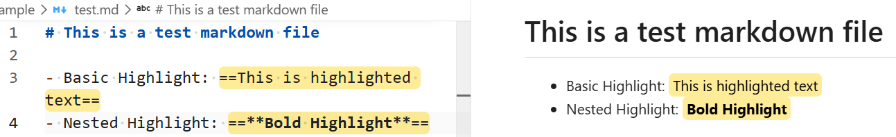
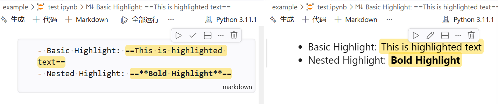

# markdown-highlight-mark

- 中文版参见：[README.zh.md](README.zh.md)

Support for highlight syntax `==...==` in Markdown previews, including Jupyter Notebook previews.

## Demo

## Usage

### Basic

Basic: ==this is highlighted==

Nested: ==**bold highlighted**==

### Keybinding

| Shortcut           | Action                                |
| ------------------ | ------------------------------------- |
| `Ctrl + Shift + =` | Wrap the selected text with `==...==` |

> Note: The keybinding may conflict with other extensions or VS Code features. Adjust in settings if needed.

### Context menu

- Use the editor context menu item "Wrap Selection with Highlight" to wrap selected text.
